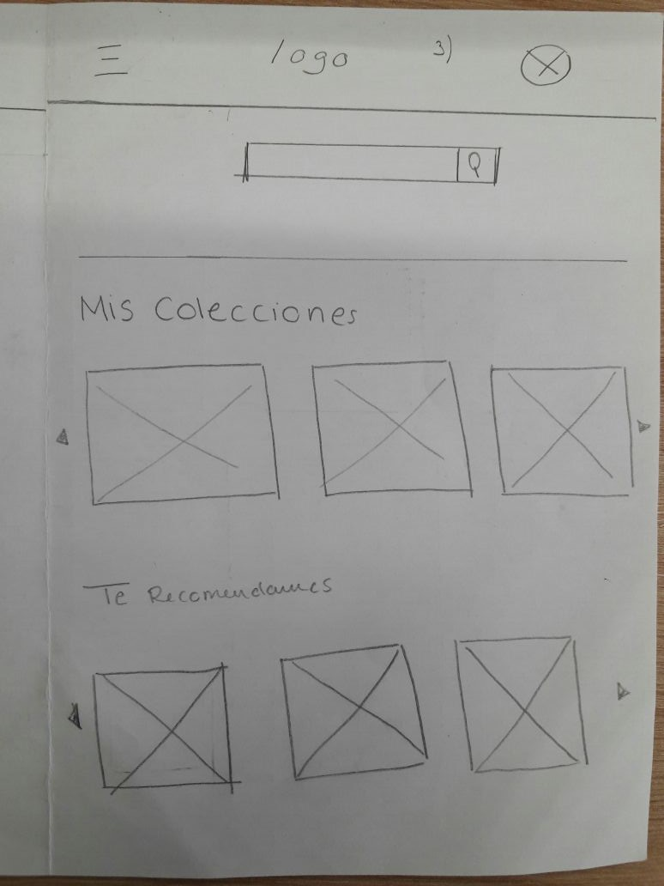

# Syneek

Syneek es un proyecto diseñado en grupo dentro de una Hackaton de Laboratoria en el cual trabajamos un app movil y web de busqueda de peliculas. Utilizamos todo lo aprendido en cuanto a JavaScript Y UX Design del Common Core

## Desarrollado para 
[Laboratoria](http://laboratoria.la)

# PROYECTO: Syneek

Syneek es una aplicación web responsive design la cual está desarrollada pensando en aquellas personas que gustan de las sagas cinematográficas. Por lo tanto, es una propuesta la cual facilita la búsqueda de estas. Esta aplicación te permitirá conocer los estrenos, organizar tus películas en colecciones y recomendarte las mejores películas de acuerdo a tus preferencias brindadas en tu perfil.

## User research

### Identificando el problema

Realizamos un brainstorming en el equipo de trabajo y las 3 ideas principales  que surgieron fueron las siguientes respecto a la aplicación:
>#### Relacionada a películas de DC Comics o Marvel
>#### Relacionada a películas que forman parte de una saga
>#### Relacionada a películas que son basadas en un libro

### Encuesta

Para poder descartar las opciones propuestas realizamos una encuesta online y obtuvimos los siguientes resultados.
Link de la encuesta: https://goo.gl/forms/QY0ks7m6yTI218Jk1

#### Resultados de la encuesta

Luego de los resultados de la encuesta pudimos concluir que la aplicación será basada en aquellas películas que formen parte de una saga.
Adicional a eso debemos tener en cuenta las recomendaciones que nos dieron los usuarios para nuestra aplicación.

#### Recomendaciones basadas en las encuestas

1. Obtener recomendaciones de la aplicación según tus preferencias.
2. Tener una lista personal de películas favoritas
3. Un buscador por tipo de película, genero, año, breve reseña y calificación (1-5 estrellas).
4. Tener link para leer los libros, comics o información relacionada de ellas.
5. Mostrar las películas que han sido nominadas y ganadoras del Oscar
6. Conectarme con personas que recomienden las películas 
7. Recomendar las películas según el rating de las mismas.
8. Brindar un link para visualizar las películas

## Benchmarking 

### Análisis de la competencia

Actualmente existen diversas plataformas que nos permiten realizar la búsqueda de películas, sin embargo, estas nos sumergen en un sin número de films que no abarcan nuestro público objetivo.

Si nos detenemos a pensar en ¿cómo categorizar las películas? o aún más importante ¿Cómo me entero de los próximos estrenos? La respuesta es fácil: según Google, existen alrededor de 80 100 000 sites con información sobre películas de distinta índole, algunos más actualizados que otros. Toda la información está recopilada, clasificada y dispuesta a quien desee conocerla.

Específicamente, para aquellos que prefieren las películas con continuación (o sagas), existen numerosos de sites que guardan esa información Google ofrece cerca de 826 000 resultados al hacer una búsqueda rápida de "películas+sagas".

Si realizamos un ranking de las películas más vistas en la historia del cine, el resultado será conformado principalmente por sagas tales como: Star Wars, Jurassic World, Avengers, Fast & Furious, Harry Potter, Transformer, El señor de los anillos, entre otros.

Entonces, ¿Cuál es el problema? Que ningún website responde a la pregunta ¿Qué películas que conforman una saga existen?... Y ¿Dónde puedo encontrar información de ellas y visualizarlas?, es un tópico poco abordado, aun cuando la mayor cantidad de películas visualizadas a lo largo de la historia del cine forman parte de una saga. Es decir, existe un grupo de personas a quienes los websites tradicionales no satisface

## Research 

###Arquetipo del usuario

Emperatriz Castilla es una chica de veintitrés años amante de las sagas cinematográficas entre ellas Harry Potter, Star Wars, Rápidos y furiosos, entre otros.
Ella actualmente trabaja en un colegio y estudia psicología, uno de sus hobbies principales son ver películas que sean parte de una saga pues le gusta la continuidad de las historias.
Por lo tanto, ella posee poco tiempo para dedicarse a navegar en la red buscando un lugar en el que pueda visualizar sus películas favoritas.

#### Objetivos de Emperatriz en nuestro website
1. Una plataforma en la cual pueda loguearse de forma sencilla con su correo de gmail desde cualquier dispositivo.  
2. Visualizar las películas que conforman una saga sin tener la preocupación de buscarlas de una en una.
3. Obtener información relacionada a las películas (libros, comics, eventos, etc.).
4. Tener la posibilidad de crear colecciones de acuerdo a sus preferencias.

### Prototipado

#### Vista splash

#### Vista login

#### Vista home 

#### Vista perfil del usuario

#### Vista results

#### Vista movie

### Prototipo en Marvel
https://marvelapp.com/2b563c2
### Planificación 
El primer día luego de escuchar las indicaciones del producto nos planificamos de la siguiente manera:

#### Flujo de la aplicación 
1.	Todo inicia con una vista splash de cinco segundos para llamar la atención del usuario.
2.	Después pasamos al login, para el cual usamos firebase con el fin de guardar los datos de la cuenta de google de nuestros usuarios, al concluir el login nos sale un aviso que nos indica que nos hemos registrado exitosamente.
3.	Posteriormente pasamos al buscador de películas de nuestra aplicación. Este nos permite encontrar las sagas que queramos. Una vez encontrarlas se nos mostraran los resultados con la imagen, el nombre de la película dentro de un botón el cual nos mostrará el título completo, año de esta y un botón con la opción de “Guardar a Colección”.
4.	Cuando deseemos entrar a nuestro perfil, entraremos a éste a través del menú hamburguesa situado en el lado izquierdo del navegador.
5.	Al entrar en nuestro perfil, vemos que nuestra información tal como nombre de usuario, imagen de perfil han sido extraídos de google.
6.	Una vez en nuestro perfil, podemos elegir nuestros géneros cinematográficos predilectos, los cuales podrán ser guardados y almacenados. De nuevo, en nuestro perfil tenemos un botón con la opción “Busca tu saga” para volver al buscador.
7.	En “Recomendaciones se encontrarán estrenos de sagas y recomendaciones según nuestros géneros favoritos.

## Herramientas utilizadas

1. HTML5
2. CSS3
3. Javascript
4. jQuery
5. Bootstrap
6. firebase
7. Marvel
8. Google forms
## Nuestro equipo 

>#### Darcy Cervera : UX Designer
>#### Romina Polo: UX Designer
>#### Ada Yajahuanca: UX Designer
>#### Margarita Sutta: Front-End Developer

